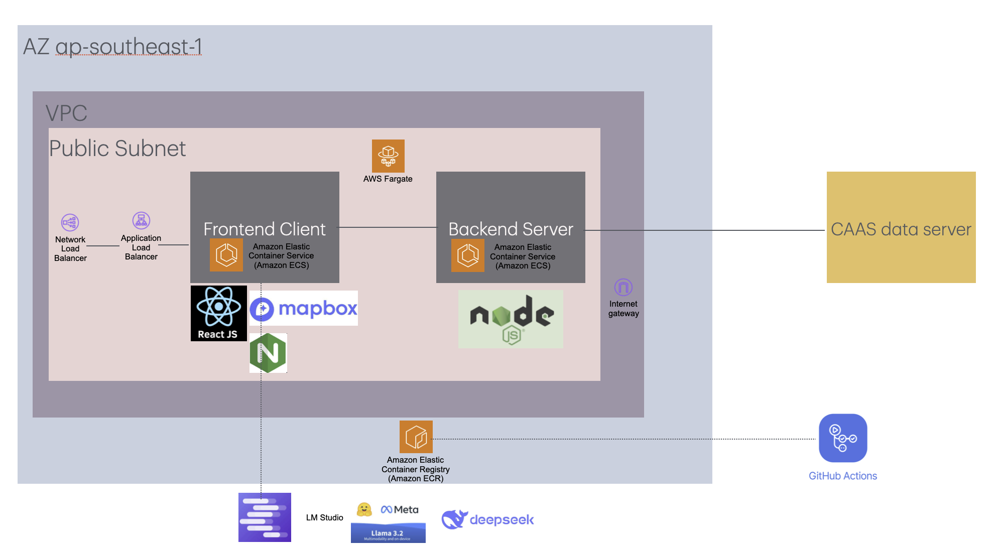
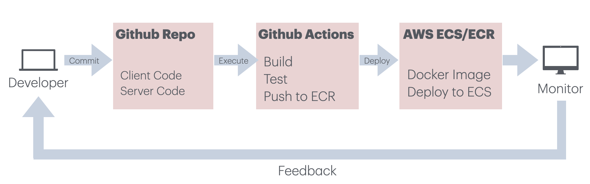
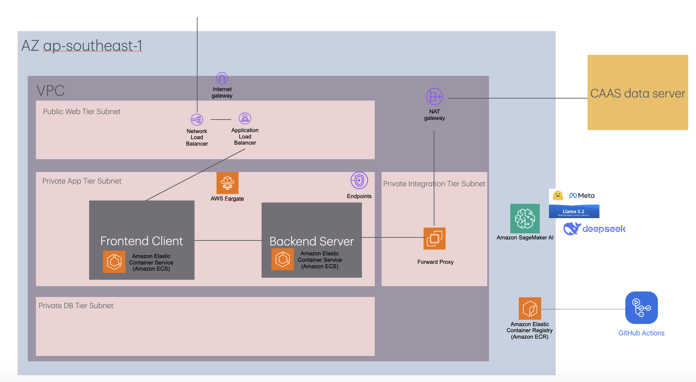

# Flight Route Viewer 🛩️

The Flight Route Viewer is a web application that visualizes flight paths using waypoints based on fixes and airways. It fetches flight data from an external API, processes it to extract waypoints and airways, and displays the flight route on an interactive map using Mapbox. The application is built with a Node.js backend and a React frontend, and it is deployed using GitHub Actions for CI/CD to AWS ECR and ECS.

## Features

- **Flight Plan Search**: Search for flight plans by callsign.
- **Flight Route Visualization**: Display the flight route on an interactive map with waypoints and airways.
- **Dynamic Updates**: Automatically update the map when a new flight is selected.
- **Generative AI**: Integrate with Self Hosted Large Language Model (LLM) - Tested with Llama 3.1 8B (Quantised) and Deepseek R1 7B QWen (distilled) to provide insights 
- **CI/CD Pipeline**: Automated build, test, and deployment using GitHub Actions to AWS ECR and ECS.

## Architecture



The application consists of the following components:

### Backend (Node.js/Express)
- Fetches flight data from an external API.
- Processes the data to extract waypoints and airways.
- Provides RESTful endpoints for the frontend to fetch flight plans and detailed flight routes.

### Frontend (React)
- Displays the flight route on an interactive map using Mapbox.
- Allows users to search for flight plans and select a flight to visualize its route.
- Allows users to prompt Generative AI for insights such as alternate route, possible issue with flight path
## CI/CD Pipeline

The CI/CD pipeline is managed using GitHub Actions:
- Automates the build, test, and deployment process.
- Builds Docker images for the client and server.
- Pushes the Docker images to AWS ECR.
- Deploys the application to AWS ECS.

### CI/CD Pipeline Diagram



## Getting Started

### Prerequisites

Ensure you have the following installed:

- Node.js (v16 or higher)
- Docker
- AWS account with ECR and ECS configured
- Mapbox access token

### Installation

#### Clone the repository:
```bash
git clone https://github.com/your-username/flight-route-viewer.git
cd flight-route-viewer
```

#### Install dependencies:
```bash
cd server
npm install
cd ../client
npm install
```

#### Set up environment variables:

1. Create a `.env` file in the `server` directory with the following content:
   ```plaintext
   API_KEY=your_api_key
   API_URL=your_api_url
   PORT=5001
   ```

2. Create a `.env` file in the `client` directory with the following content:
   ```plaintext
   REACT_APP_MAPBOX_ACCESS_TOKEN=your_mapbox_access_token
   REACT_APP_API_URL=http://server ip:port
   ```

### Run the Application

#### Start the server:
```bash
cd server
npm start
```

#### Start the client:
```bash
cd client
npm start
```

#### Access the application:
Open your browser and navigate to `http://localhost:3000`.

## Deployment

The application is automatically deployed to AWS ECR and ECS using GitHub Actions. The CI/CD pipeline is triggered on every push to the `main` branch.

### Set up AWS credentials:
Add the following secrets to your GitHub repository:

- `AWS_ACCESS_KEY_ID`
- `AWS_SECRET_ACCESS_KEY`
- `AWS_REGION`
- `ECR_REPOSITORY_CLIENT`
- `ECR_REPOSITORY_SERVER`

### Push to main branch:
Push your changes to the `main` branch to trigger the CI/CD pipeline.

### Monitor deployment:
Check the **GitHub Actions** tab in your repository to monitor the build and deployment process.

## Code Structure

### Backend
- `server.js` - Main server file that sets up the Express app and defines the API endpoints.
- `fetchStaticData.js` - Fetches static data (fixes and airways) from the external API.
- `routes/` - Contains the route handlers for the API endpoints.

### Frontend
- `App.js` - Main React component that handles the UI and interacts with the backend.
- `mapbox-gl.css` - Styles for the Mapbox map.
- `components/` - Contains reusable React components.

## Code Walkthrough
- Server
1) fetchStaticData() 
2) app.get('/healthcheck')
3) app.get('/api/flight-plans')
4) app.get('/api/flight-plan/:callsign')

- Client
1) Fetch flight plans for dropdown list
2) Filter flight plans based on search query
3) Initialize map
4) Update flight route when flight is selected
5) Generative AI

### CI/CD
- `.github/workflows/ci-cd.yml` - GitHub Actions workflow file that defines the CI/CD pipeline.

---

### Enhancement



